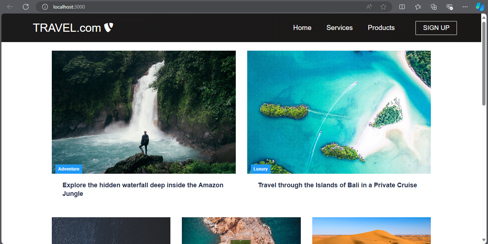

# TRAVEL.com

**TRAVEL.com** is a simple, customizable travel website template designed to help Travel and Tourism companies establish their online presence. This template provides a solid foundation for creating a professional website, including essential pages and features.



## Features

- **Home Page**: 
  - A welcoming introduction to your travel services.
  - Footer section with:
    - **Join the Adventure Newsletter**: Allows visitors to subscribe by entering their email to receive the best vacation deals.

- **Services Page**: 
  - Showcase the various travel services offered by the company.

- **Products Page**: 
  - Display travel-related products available for purchase.

- **Signup Page**: 
  - A user-friendly form for new users to create an account and start exploring travel options.

## Footer Sections

1. **About Us**
   - How it works
   - Testimonials
   - Careers
   - Investors
   - Terms of Service

2. **Contact Us**
   - Contact
   - Support
   - Destinations
   - Sponsorships

3. **Videos**
   - Submit Video
   - Ambassadors
   - Agency
   - Influencer

4. **Social Media**
   - Instagram
   - Facebook
   - YouTube
   - Twitter

## Installation

### Prerequisites
- Node.js and npm installed on your machine

### Steps
1. **Clone the repository:**
   ```bash
   git clone https://github.com/Prakash1256/Travel.git
   ```
2. **Navigate to the project directory:**
   ```bash
   cd TRAVEL.com
   ```
3. **Install dependencies:**
   ```bash
   npm install
   ```
4. **Run the application:**
   ```bash
   npm start
   ```

   
---

This README provides a comprehensive overview of your project, highlighting key features and guiding users through setup and customization.
